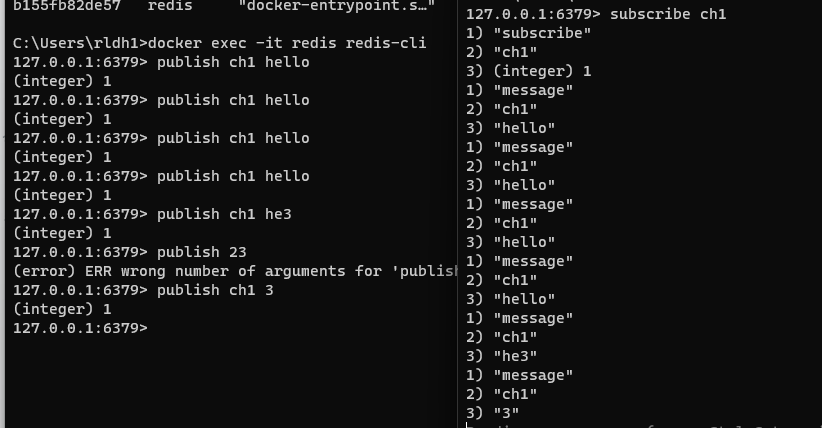

### 레이스 컨디션이란
공유 자원에 대해 여러개의 쓰레드 또는 프로세스가 동시에 접근해 실행순서에 따라 결과값이 변하는 문제를 말한다.


### 테스트 코드
```java
    @Test
    public void 동시에_100개_요청() throws InterruptedException {
        int threadCount = 100;
        ExecutorService executorService = Executors.newFixedThreadPool(32);
        CountDownLatch countDownLatch = new CountDownLatch(threadCount);
        for (int i = 0; i < threadCount; i++) {
            executorService.submit(() -> {
                try {
                    stockService.decrease(1L, 1L);

                } finally {
                    countDownLatch.countDown();

                }

            });

        }
        countDownLatch.await();
        Stock stock = stockRepository.findById(1L).orElseThrow();
        Assertions.assertThat(stock.getQuantity()).isEqualTo(0L);
        System.out.println(stock.getQuantity());
    }
```

### 동시성 문제가 발생하는 코드
```java
    public void decrease(Long id, Long quantity) {
        Stock stock = stockRepository.findById(id).orElseThrow();
        stock.decrease(quantity);
        stockRepository.saveAndFlush(stock);
    }
```


### 트랜잭션을 적용한 코드  
- 트랜잭션을 사용하면 동시성 문제가 해결되지 않는다.  
- 실제 데이터베이스에 업데이트 되기 전에 다른 스레드가 실행되면서 갱신되기 전의 값을 가져가기 때문이다.
```java
    @Trasactional
    public void decrease(Long id, Long quantity) {
        Stock stock = stockRepository.findById(id).orElseThrow();
        stock.decrease(quantity);
        stockRepository.saveAndFlush(stock);
    }
```

# sychronized 키워드를 사용해 동시성 문제 해결
```java
    public synchronized void decrease(Long id, Long quantity) {
        Stock stock = stockRepository.findById(id).orElseThrow();
        stock.decrease(quantity);
        stockRepository.saveAndFlush(stock);
    }
```
### Sychronized의 문제점
서버가 한 대 일때는 문제가 없지면 서버가 여러대가 되면 데이터의 접근을 여러대가 할 수 있기 때문에 동시성 문제가 다시 발생한다.


# MySQL을 활용한 동시성 문제 해결방법
- Pessimistic Lock
  - 실제로 데이터에 Lock을 걸어서 정합성을 맞추는 방법
  - exclusive lock을 걸게 되고, 다른 트랜잭션에서는 lock이 해제되기 전에 데이터를 가져갈 수 없다.
  - 주의 : 데드락이 걸릴 수 있다. 
  - 장점 : 충돌이 빈번하게 일어날 경우 Optimistic Lock보다 성능이 좋을 수 있다. Lock을 통해 update를 제어하기 때문에 데이터의 정합성이 보장된다.
    단점 : 별도의 Lock을 잡기 때문에 성능 감소가 있을 수 있다.
  
- Optimistic Lock
  - 실제로 Lock을 이용하지 않고 버전을 이용함으로써 정합성을 맞추는 방법
  - 먼저 데이터를 읽은 후에 update를 수행할 때 현재 내가 읽은 버전이 맞는지 확인하고 update를 수행한다.
  - 내가 읽은 버전에서 수정사항이 생겼을 경우에는 application에서 다시 읽은 후에 작업을 수행해야 한다.
  - 장점: 별도의 Lock을 잡지 않아 Pessimistic Lock보다 성능상으로 이점이 있다.
  - 단점: update가 실패했을 때 재시도 로직을 개발자가 직접 작성해야 하는 번거로움이 있다.
  - 충돌이 빈번하게 일어날 것이라고 예상되면 Pessimistic Lock을 사용하는 것이 좋다.
  - 충돌이 빈번하게 일어나지 않을 것이라고 예상되면 Optimistic Lock을 사용하는 것이 좋다.
  
- Named Lock
  - 이름을 가진 metadata locking이다.
  - 이름을 가진 lock을 획득한 후 해재할떄까지 다른 세션은 이 lock을 획득할 수 없도록 한다.
  - 주의할 점으로는 trasaction이 종료될 때 lock이 자동으로 해제되지 않는다.
  - 별도의 명령어로 해제를 수행해주거나 선점시간이 끝나야 해제된다.
  - MySQL에서는 get_lock 명령어를 통해 획득할 수 있고 release_lock 명령어를 통해 해제할 수 있다.
  - 실무에서는 데이터소스를 따로 분리해서 사용하는 것이 좋다.
  - 주로 분산 락을 구현할 때 사용한다.
  - Time out을 손쉽게 구현할 수 있다.
  - 데이터 삽입 시 정합성을 맞춰야 할 경우 사용할 수 있다.
  - 트랜잭션 종료시 락 해제 세션 관리를 잘 해주어야 하기 때문에 주의해서 사용해야 하고 실제 사용 시 구현 방법이 복잡해할 수 있다.


### Pessimistic Lock


```java
    @Lock(LockModeType.PESSIMISTIC_WRITE)
    @Query("select s from Stock s where s.id = :id")
    Stock findByIdWithPessimisticLock(Long id);
```

```java
    @Transactional
    public void decrease(Long id, Long quantity) {
        Stock stock = stockRepository.findByIdWithPessimisticLock(id);
        stock.decrease(quantity);
    }
```
### 실행결과  


### Optimistic Lock
재시도 로직을 만들어줘야함

```java
@Entity
@Getter
@NoArgsConstructor(access = AccessLevel.PROTECTED)
public class Stock {
    
  //기존 내용
    
  @Version
  private Long version; //추가된 코드
}

```

```java
    @Lock(LockModeType.OPTIMISTIC)
    @Query("select s from Stock s where s.id = :id")
    Stock findByIdWithOptimisticLock(Long id);
```


```java
    @Transactional
    public void decrease(Long id, Long quantity) {
        Stock stock = stockRepository.findByIdWithOptimisticLock(id);
        stock.decrease(quantity);
    }
```

```java
    public void decrease(Long id, Long quantity) throws InterruptedException {
        while (true) {
            try {
                optimisticLockStockService.decrease(id, quantity);
                break;
            } catch (Exception e) {
                Thread.sleep(50);
            }
        }
    }
```


### Named Lock


```java

    @Query(value = "select get_lock(:key, 3000)", nativeQuery = true)
    void getLock(String key);


    @Query(value = "select release_lock(:key)", nativeQuery = true)
    void releaseLock(String key);

```

새로운 트랜잭션을 만들어서 해야함
```java
    @Transactional(propagation = Propagation.REQUIRES_NEW)
    public void decrease(Long id, Long quantity) {
        Stock stock = stockRepository.findById(id).orElseThrow();
        stock.decrease(quantity);
        stockRepository.save(stock);
    }
```


```java
    public void decrease(Long id, Long quantity) {
        try {
            lockRepository.getLock(id.toString());
            stockService.decrease(id, quantity);
        } finally {
            lockRepository.releaseLock(id.toString());
        }
    }
```


# Redis 분산락을 사용한 동시성 문제 해결

- Lettuce
  - setnx 명령어를 활용하여 분산락 구현
    - setnx : SET if Not eXist의 줄임말로, 특정 key에 value 값이 존재하지 않을 경우에 값을 설정(set)하는 명령어
  - spin lock 방식
    - lock을 획득하려는 스레드가 lock을 사용할 수 있는지 반복적으로 확인하면서 lock 획득을 시도하는 방식
      retry 로직을 개발자가 작성해주어야 합니다.
  - Spring data redis를 이용하면 lettuce가 기본이기 때문에 별도의 라이브러리를 사용하지 않아도 됩니다.
    

- Redisson
  - pub-sub 기반으로 Lock 구현 제공
  - Redisson 라이브러리 추가하기
  - Redisson은 lock 관련 class를 라이브러리에서 제공해주기 때문에 별도의 repository를 작성하지 않아도 됩니다.
    


### Lettuce를 사용한 동시성 문제 해결
MySQL Named Lock과 비슷함
세션 관리에 신경을 쓰지 않아도 됨

```java
@Repository
@RequiredArgsConstructor
public class RedisRepository {

    private final RedisTemplate<String, String> redisTemplate;

    public Boolean lock(Long key) {
        return redisTemplate
                .opsForValue()
                .setIfAbsent(generateKey(key), "lock", Duration.ofMillis(3000));
    }

    public Boolean unlock(Long key) {
        return redisTemplate
                .delete(generateKey(key));
    }

    private String generateKey(Long key) {
        return key.toString();
    }
}

```

```java

    public void decrease(Long id, Long quantity) throws InterruptedException {
        while (!redisRepository.lock(id)) {
            Thread.sleep(100);
        }
        try {
            stockService.decrease(id, quantity);
        } finally {
            redisRepository.unlock(id);
        }
    }
```


### Redisson를 사용한 동시성 문제 해결


```java
@Component
@RequiredArgsConstructor
public class RedissonLockStockFacade {

    private final RedissonClient redissonClient;
    private final StockService stockService;

    public void decrease(Long id, Long quantity) throws InterruptedException {
        RLock lock = redissonClient.getLock(id.toString());

        try {
            boolean available = lock.tryLock(30, 1, TimeUnit.SECONDS);
            if (!available) {
                System.out.println("lock 획득 실패");
                return;
            }
            stockService.decrease(id, quantity);
        } catch (Exception e) {
            throw new RuntimeException(e);
        } finally {
            lock.unlock();
        }
    }
}

```

## 실무
- 재시도가 필요한 경우에는 redisson 활용
- 재시도가 필요하지 않은 경우에는 lettuce 활용

### Mysql과 Redis 비교
- Mysql
  - 이미 Mysql을 사용 중이면 별도의 비용 없이 사용 가능함
  - 어느 정도의 트래픽까지는 문제없이 활용 가능
  - Redis 보다는 성능이 좋지 않음


- Redis
  - 사용 중인 Redis가 없다면 별도의 구축 비용과 인프라 관리 비용이 발생함
  - Mysql 보다 성능이 좋음
 
